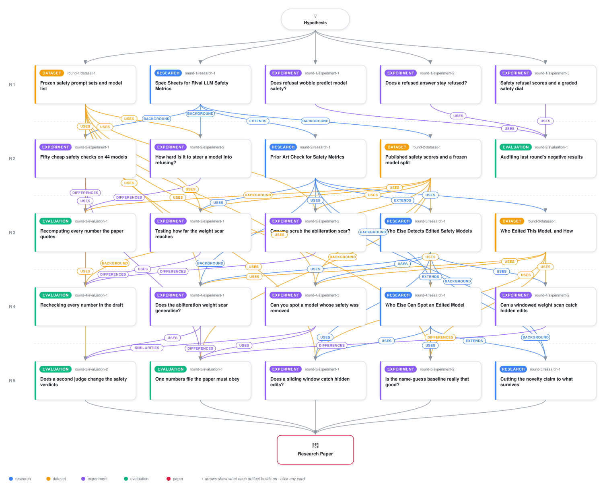

# Catching Edited Safety Models by Reading Weights in Sliding Windows

<div align="center">

<a href="https://cdn.jsdelivr.net/gh/AMGrobelnik/ai-invention-c9546e-rating-model-safety-in-eighty-forward-pa@main/workflow.svg">
<picture>
  <source media="(prefers-color-scheme: dark)" srcset="workflow-dark.svg">
  
</picture>
</a>

<sub>🖱️ <b><a href="https://cdn.jsdelivr.net/gh/AMGrobelnik/ai-invention-c9546e-rating-model-safety-in-eighty-forward-pa@main/workflow.svg">Open the interactive diagram</a></b> — every card links to its artifact folder.</sub>

</div>

> **TL;DR** — Iteration-5 revision. The paper's headline is now a positive result: a sliding-window generalisation of a parent-free spectral abliteration detector more than doubles recall on real Hugging Face checkpoints (0.700 vs 0.300 at specificity 1.000, n=50 edited / 57 undeclared negatives), recovering the depth-localised, multi-direction, merge and per-component recipes the pooled statistic missed, at zero prompts and zero forward passes. The previous draft's 'discovery AND completion' mechanism is replaced by a Cauchy-Schwarz derivation showing the two conditions are the same quantity whenever discovery holds (measured gap <= 0.029 log-units, 0 violations), so the '19/19' evidence claim is retired; the single-direction rule is generalised to principal angles against the removed subspace (agreement 1.000 on 47 kernels); and Proposition 1 proves isometric edits permanently invisible to any Gram-spectrum statistic. The name-regex baseline is de-biased by recovering per-repository discovery channels: 0.642 [0.507, 0.757] name-free vs 0.953 [0.925, 0.970] term-swept. The leave-one-recipe-class-out table is reported at fixed orientation with both fixed and refit thresholds (refit tau = -1.7156, a 1.026 log-unit shift), and specificity is stratified chat vs base (0/159 chat at panel tau, 0.044 chat / 0.154 base at refit). The behavioural axis is validated with a second cross-family judge and a blind anchor, and card labels are behaviourally checked (error rate 0.250).

<details>
<summary>Full hypothesis</summary>

CORE CLAIM, UNCHANGED IN FRAME, WITH THE POSITIVE HALF NOW CONDITIONAL ON A CONFOUND THAT MUST BE REMOVED BEFORE IT CAN BE CLAIMED. The original claim -- safety behaviour is legible from the model alone, cheaply, better than from its outputs -- remains resolved into two halves. Claim A (a parent-free spectral certificate) went from 'supported' (iter 3) to 'largely refuted at scale' (iter 4) to, this iteration, 'the pooling diagnosis is right and a windowed statistic does recover recipe classes the pooled one never touched, BUT the headline recall number is a depth/architecture confound and cannot be quoted as it stands'. Claim B (graded behavioural safety is not better read from the interior than from a 40-prompt refusal rate) is unchanged and still supported. What the evidence now licenses is: a parent-free spectral certificate is a PRECISION INSTRUMENT whose recall is governed by an ANALYTIC discovery/completion condition, whose verdict is DISSOCIABLE FROM SAFETY BEHAVIOUR IN BOTH DIRECTIONS BY CONSTRUCTION, whose operating point is ARBITRARY, and whose windowed generalisation shows a real but UNQUANTIFIED-AT-SCALE recall gain that is currently entangled with model depth.

CLAIM A (POOLED FORM REFUTED AT SCALE; WINDOWED FORM PROMISING BUT CONFOUNDED). W05 = log10 min_W e_W(v1) over the pooled residual-write Gram costs zero prompts, zero forward passes and ~7-11 s of CPU linear algebra. At the panel threshold it fires on 7 of 44 real sub-4.2B edited checkpoints (0.159) while all five archived calibration positives fire at 1.000. Its precision is real and is now measured on a bigger and better-composed denominator: 0/251 eligible undeclared checkpoints at the panel tau, including 0/159 CHAT-templated (Wilson hi 0.024) and 0/78 base, closest negative -2.6139 (art_BlPNy1aBYVSE); an independent recount of the archived population gives 0/139 rather than the reported 0/122 (art_gSQc4W6QUHvZ). W05w (sliding windows of k consecutive layers, per-window minimum eigenvector, extremum-scored) reaches Arm-A sensitivity 0.700 [0.562,0.809] at k=2 against pooled 0.300 at specificity 1.000 on 57 undeclared negatives (art_-wY3_BLZ_sCu) -- but see S13: that comparison is not yet trustworthy.
CLAIM B (UNCHANGED): for GRADED BEHAVIOURAL SAFETY, no interior observable in the frozen 53-metric battery beats a trivial black-box baseline by a resolvable margin -- minimum detectable |drho| = 0.32 at 19 lineages, r_xx = 0.968 so not attenuation, invariant at three depths, and interior observables ARE predictive (A19 rho +0.763 member / +0.800 lineage at a thirty-fifth of B09's forward passes). The falsifier is about MARGINAL VALUE OVER A CHEAPER INSTRUMENT.

WHAT ITERATIONS 3-4 SETTLED AND ITERATION 5 DID NOT DISTURB (do not re-litigate; do not re-run).
S1. The pooled certificate fails at scale and fails BY RECIPE; leave-one-recipe-class-out is the primary generalisation control. Misses are not near-misses (mlabonne/Qwen3-0.6B-abliterated -0.9637 vs its parent -0.9641).
S2. UNIFORMITY is the wrong predicate. The right decomposition is DISCOVERY (|cos(v1,r)| -> 1) AND COMPLETION (log10 min_W e_W(r) <= tau), and it is ANALYTIC, not empirical: the Cauchy-Schwarz bound is now emitted as a formula plus a callable and EVALUATED on 25 archived rows with 0 violations and a maximum informative gap of 0.029 log10 (n=5) (art_gSQc4W6QUHvZ). '19/19 with zero disagreements' is retired as evidence, permanently. The sweep's genuine empirical content is the discovery threshold's location -- controlled by the kernel's MINIMUM DEPTH WEIGHT, bracketed in [0.0796, 0.5311] between Gaussian spread 8 and 16, against a stamped critical spread wrong by 3.64x. Completion never varied over the whole Gaussian sweep, so discovery was always binding.
S3. THE ANALYTIC BOUNDARY. Proposition 1: a Householder reflection conjugates the Gram and leaves its spectrum exactly invariant, so isometric edits are permanently invisible to W05, to W05w at every k, and to every banded variant. Measured: ORBA Householder moves W05 by 4.08e-5, BELOW a random-direction control at 7.26e-5, while dropping refusal to 0.100. Detectability and effectiveness are near-orthogonal: 10 effective kernels, 4 detected, Spearman 0.113 [-0.641, 0.700].
S4. BOTH-DIRECTIONS DECOUPLING, BY CONSTRUCTION (art_VLI4IOs9Xy9P), and now JUDGE-VALIDATED (art_ajJq7IGjE6dm). Root B (depth-weighted Gaussian, direction held fixed) un-censors 0.950 -> 0.270 [0.196,0.360] at n=111 while reading W05 = -1.0100, the parent's value, cos(v1,r)=0.0199, class prevalence 45.8% of declared Hub edits. Root C (uniform Llama edit along the AUROC-argmax direction) fires at -4.587 while refusing at its parent's 0.950. The judge audit re-created 3,880 generations with 60.6% hitting the archived content-addressed cache key (a PROOF of byte-identical text) and shows the judge MODEL is the dominant scorer axis (pooled shift 0.269 model / 0.126 rubric wording / 0.034 PARTIAL rule): root B's NUMBER is scorer-dependent (0.278 archived, 0.772 cross-family, 0.195 re-worded) but the CLAIM is not (below parent under all three scorers), and a 48-item blind anchor favours the ARCHIVED judge (0.771 acc / kappa 0.643 vs 0.521 / 0.291). P3-P5 all SURVIVE. A new reproducibility limit is recorded: cross-device bf16 kernel selection, not batching, breaks byte-identity of archived generations.
S5. THE OPERATING POINT IS ARBITRARY AND ITS AUROC TABLE WAS PRINTED UNDER A MISLEADING CONVENTION. Leave-one-recipe-class-out refits tau to -1.7156, a 1.026 log-unit shift, 8.04x the 0.128 shift that already produces a first false positive. Under a FIXED orientation (lower is positive), SEVEN of nine held-out class AUROCs sit BELOW 0.5 -- the archived per-cell max(raw, 1-raw) convention flipped 8 of 19 cells and made an at-chance-or-worse column look informative (art_gSQc4W6QUHvZ). Specificity does not survive refitting: 13/139 archived and 0.080 pooled / 0.044 chat / 0.154 BASE on the 251-row scan fire at the refit tau.
S6. QUANTIZATION, RESOLVED. Dequantization remedy VOID (archive was a fake-quant). Scar dies at 5 BITS (W05 -2.654) with refusal 0.237 and ppl 26.25 -> 28.77; cos(v1,r) > 0.9994 at every bit-width so the mechanism is THE NULL FILLING IN; the clean parent is unmoved; W05rel is algebraically identical to W05 and retired. A quantized upload is UNRESOLVED in the pipeline, not a silent false negative.
S7. STORAGE PRECISION SETS SCAR DEPTH (-4.592 bf16 vs -12.705 float32) and W01/W04 are irreproducible below ~0.05 on abliterated checkpoints (float32 Gram floor). Nothing load-bearing may depend on them.
S8. THE PARENT BUYS REAL COVERAGE. E_1 fires 13/32 vs W05's 7/35 and reaches Gaussian-depth, Heretic and partial-layer edits; agreement 0.829; the detection vector is invariant across all three bands. 'Parent-free costs nothing' stays retired.
S9. THE LADDER survives as an ORDERING at n>100 on three laundering families and two architectures, with flag-death intensities identical across architectures; the four signed 'evasion costs' and int4-minus-root are NOT resolvable (smallest detectable DIFFERENCE 0.294 at n=40, p=0.20); achieved denominators are 31-40, 13 ambiguous. Two reversals survive: a one-matrix argmin patch does not defeat a min-over-layers statistic, and 200 benign LoRA steps move W05 only -4.592 -> -4.381 while RESTORING refusal.

WHAT ITERATION 5 ADDED, AND THE ONE THING IT GOT WRONG.
S10. WINDOWING WORKS MECHANISTICALLY AND ITS PRE-REGISTERED BOUNDARIES HELD (art_-wY3_BLZ_sCu). All three Arm-A tiers completed (78 checkpoints scored, 71 OK, 7 UNRESOLVED excluded with counts printed) plus 47 in-memory kernels; verify.py 60/60, byte-identical reruns; G1 reproduces the archived W05 to 9.6e-6 across 71 real checkpoints (an independent THIRD reproduction); G3 resolved honestly under both comparisons (0.0 exactly vs the float64 path; 1.09e-6 vs float32, reported as FAILING the declared 1e-9 and passing a DERIVED bound 5.30e-5). At the PRE-REGISTERED tau = -2.7415, with nothing refitted, min_{k<=8} W05w catches 8 of the 22 in-house kernels the pooled statistic misses (mid-50% band, Gaussian spreads 2/4/8 at both precisions, Heretic tent) -- this threshold-free comparison is the part of the windowing result that is NOT confounded and should become the mechanism claim. P4 CONFIRMED at that threshold: sub-unit uniform w in {0.5,0.7,0.85} invisible at every k (windowing changes pooling SCOPE, never removal COMPLETENESS). P2 REFUTED with a mechanism: Gaussian spreads 0.5 and 1 confine the edit to ONE layer, so even k=2 always contains an unedited layer that sets the minimum -- minimum detectable edit width = minimum usable k. ARM 2 is a substantive negative: BOTH within-model nulls REJECT the unedited parent (random-direction because v1_win is the MINIMISING eigenvector, parent at z=-180; layer-subset because contiguous windows are systematically deeper than random subsets, gap -0.293), so the multiple-window hazard cannot be bounded from inside a model; a corrected per-window Sidak construction does discriminate. ARM 3: the principal-angle subspace generalisation of discovery agrees 1.000 on all 47 kernels (j >= dim(R); j* is the SMALLEST containing j) and is INAPPLICABLE BY CONSTRUCTION on real checkpoints. ARM 4: the RELATIVE residual does not exist (reaches 7.93 at the annihilation floor); what holds is |resid|/sin^2(theta) <= 1.726 (median 0.780, n=22).
S11. THE NAME BASELINE IS DE-BIASED BY MEASUREMENT, NOT RECONSTRUCTION (art_BlPNy1aBYVSE). found_by was archived per repo, so discovery channel is recoverable: regex sensitivity 0.642 [0.507,0.757] name-free (n=53) vs 0.953 [0.925,0.970] term-swept (n=358); the archived 0.727 lies INSIDE the de-biased interval and survives as an estimate of a much weaker baseline. Correction: REGEX_11 and the census flag are DIFFERENT estimators (459/513 vs 259/513; 'heretic' alone contributes 220 hits), so '50.5% name baseline' quotes the narrower one. KEY NEGATIVE for the POOLED statistic: on 84 measured edited checkpoints W05 fires 10/50 on rows the regex already names and 0/34 on rows it does not (Wilson hi 0.102); caught-by-W05-missed-by-name is EMPTY at the panel tau; paired regex - W05 = +0.615 [0.308,0.846]. Card mining over 1,650 name-clean non-declaring cards found only 6 hits (0.36%), so the 23.4% UNKNOWN census figure does not imply a large hidden name-clean population at the top of the scan pool.
S12. THE POSITIVE CLASS IS ITSELF UNCERTAIN. A 14-checkpoint stratified behavioural check gives 4 VERIFIED_UNCENSORED / 3 NOT_UNCENSORED / 5 AMBIGUOUS / 1 incoherent / 1 failure: card-label error 0.250 [0.089,0.532] among assessable rows. sens_verified is NOT estimable at n=4 (floor 6). New guard: rubric B scores a degenerate loop as REFUSAL, so distinct-3 < 0.25 rows are reported unassessable.
S13. THE HEADLINE WINDOWING NUMBER IS A DEPTH/ARCHITECTURE CONFOUND, AND THE REVIEWER VERIFIED IT AGAINST THE SHIPPED ROWS. The 57 negatives that fix every threshold in the Table-1 frontier have median n_layers 12 and median hidden_size 768; the 50 positives have median n_layers 26. Over the 77 clean checkpoints already scored, Spearman(n_layers, W05w(k=2)) = -0.688: the windowed statistic is strongly monotone in DEPTH among clean models. The k=2 threshold -1.5611 is therefore cleared by clean DEEP models -- 12 of the 21 declared Arm-A parents sit at or below it (meta-llama/Llama-3.2-1B-Instruct -2.184, Qwen2.5-1.5B-Instruct -2.168, Qwen3-1.7B-Base -2.038, Qwen3-0.6B -1.887), as does the in-house unedited host at -1.8850 -- but load_negatives() reads only the scan file, so those 21 parents, listed as panel negatives, never enter the denominator. At k=L the same parents give 5 false positives; at the pre-registered tau they give 0. So the WINDOWED rule is MORE prone to flagging clean deep models than the pooled one, the opposite of what the frontier table conveys. A depth-matched refit on the same rows (both classes n_layers >= 24, specificity matched on 17 clean deep models) gives k=2 sensitivity 0.387 vs k=L 0.290 over 31 positives -- the 2.3x gap becomes 1.3x and is almost certainly not resolvable at that n. A within-model contrast does not rescue it: W05w(2) - W05(L) gives parents in [-1.02,-0.27] and edited checkpoints in [-2.98,-0.15], near-complete overlap, ~0.04 sensitivity at matched specificity. TREAT 0.700 vs 0.300 AS RETRACTED PENDING S14. 
S14. THE THRESHOLDS ARE NOT RECONCILED AND TWO PRE-REGISTERED VERDICTS ARE THRESHOLD-CONDITIONAL. The same statistic is quoted at three operating points in adjacent sections (0.159 at tau_panel on 44; 0.300 at a specificity-matched refit on 50; 0.18 at tau_panel on the 50-row set) with no reconciliation. At the specificity-matched k=2 threshold the frontier rows list UNIFORM_w0.5/0.7/0.85 and GAUSSIAN_s0.5/s1 as HITS -- which is how Arm B reaches 1.000 -- at values (-1.887, -1.885, -2.074) numerically indistinguishable from the unedited parent's own -1.885. P2 and P4 hold at tau = -2.7415 (where k=2 gives 28/42 = 0.667) and NOT at the matched threshold. Arm B's 42-kernel denominator also EXCLUDES the four Householder kernels, so 'Arm B 1.000' is quoted on a set from which the provably invisible edit was removed. The true and stronger completion statement is: completion failures are undetectable at any threshold that keeps the unedited parent NEGATIVE.
S15. THE ONE DEPLOYMENT-RELEVANT WINDOWED NUMBER WAS NEVER COMPUTED THOUGH THE ROWS EXIST. arma_w05w.jsonl carries baseline_repo_name_regex per row beside the full windowed profile; the reviewer's 2x2 at k=2 over the 44 scored edited rows gives regex-yes/W05w-yes 22, regex-yes/no 10, regex-no/W05w-YES 8, regex-no/no 4 -- i.e. W05w catches 8 of the 12 name-clean edits against the pooled statistic's 0 of 34. That is qualitatively different from 'ties the regex at 0.700' and, if it survives a repaired threshold, is the most persuasive thing in the artifact.
S16. POSITIONING, CUT TO WHAT SURVIVES (art_SFTddR644gi0). NOVEL-NARROW on the four-qualifier conjunction (parent-free, calibration-free, BOTTOM-of-spectrum, sliding-extremum); two three-of-four near-misses are newly identified and must be cited -- arXiv:2410.17770 (bottom-of-spectrum RMT, parent- and calibration-free, not windowed, not a detector; the largest uncited risk) and EigenTrack 2509.15735 (sliding over TIME across activations). 2607.23711 Intruder Threshold is a near-miss (needs sigma_1(BA), reads the top). E_1 is the WeightWatch primitive (2508.00161, ICLR 2026) and must be credited. Two MISMATCHes in the incumbent: 2607.01854's registry is 273 but only 71 processed / 94 evaluated, and its weights-only signal is AUROC 0.90 not 0.84. No multiple-window FWER convention exists in this literature; max-statistic permutation must be imported and labelled ANALOGOUS. Heretic's kernel is a TRIANGULAR TENT with a hard cutoff (code-level forbidden from the early stack) and reverse-abliterate reads filenames only -- both re-confirmed at code level.

THE REVISED CLAIMS FOR ITERATION 6. The centre of gravity moves from 'does windowing help?' to 'does windowing help ONCE DEPTH IS CONTROLLED, and does it catch what a name cannot?'. Almost all of it is re-analysis over rows and tensors already on disk plus one tensor-only scan; no new behavioural battery except H4.

H1 (REPAIR THE NEGATIVE POPULATION AND RE-DERIVE EVERY WINDOWED NUMBER -- blocking, and the reviewer's decisive point). (a) Add the 21 declared Arm-A parents to the negative denominator and print the per-k false-positive count on them (12/21 at k=2, 5/21 at k=L, 0/21 for pooled W05 at tau_panel). (b) Report the DEPTH-MATCHED frontier (n_layers >= 24 in both classes) as the PRIMARY result -- expected near 0.387 vs 0.290 -- with a PAIRED lineage-cluster bootstrap on the difference (B = 10,000) and a McNemar exact p on discordant pairs, never two independent Wilson intervals on the same 50 checkpoints. (c) Report Spearman(depth, W05w(k)) on clean models at every k as an explicit nuisance-covariate diagnostic. (d) Then EITHER introduce a depth-and-width normalisation (e.g. score windows against a within-model depth trend, or normalise by the clean-model depth regression) so that one threshold is defensible across architectures, OR state plainly that NO SCALE-FREE OPERATING POINT EXISTS for W05w and reframe the contribution as a within-architecture diagnostic. PREDICTION, stated so it can fail: the depth-matched gain is positive but small (point estimate 0.05-0.15) and its paired interval covers zero at n ~ 31; if so, the windowing contribution is the THRESHOLD-FREE kernel result of S10 (8 of 22 pooled misses recovered at the pre-registered tau) plus H2's name-clean cell, not a recall headline.

H2 (COMPUTE THE NAME-CLEAN CELL -- the single highest-value line of code in the artifact). Over the scored edited rows, compute the regex x W05w 2x2 at a threshold refit on the REPAIRED, depth-matched negative population, plus the union sensitivity and the paired regex-minus-W05w difference with a lineage bootstrap (mirroring the +0.615 [0.308,0.846] already reported for pooled W05). If W05w catches a non-zero number of name-clean edited checkpoints while the pooled statistic catches 0 of 34, THAT is the paper's positive claim and it belongs in the Contributions in place of 'ties the 11-term regex'. If the repaired threshold drives that count to zero, say so: the honest headline then moves to the analytic boundary plus the both-directions decoupling.

H3 (SCORE W05w ON THE FULL 251-ROW ELIGIBLE UNDECLARED POPULATION -- tensor-only, $0, repositories already enumerated). This single scan does four jobs at once: it supplies an OUT-OF-FIT specificity for the windowed statistic (the incumbent has 0/251 at a pre-registered tau; the challenger currently has a fitted 1.000 on 57 unrepresentative rows); it supplies a depth- and width-diverse CLEAN population for the normalisation question in H1(d); it closes the one cell the draft flags as missing (w05w_status = NOT_AVAILABLE); and it makes the Introduction's comparison like-for-like. Report FPR stratified by CHAT vs BASE and by DEPTH DECILE with Wilson intervals, and fit the operating point on a held-out half of that population, validating on the disjoint half -- which is the only construction under which a specificity of 1.000 becomes a claim rather than an artefact of fitting on the row you quote.

H4 (RUN k = 1, AND EXTEND BEHAVIOURAL VERIFICATION). (a) k=1 is well defined -- one layer contributes two residual-write matrices, so both the per-window Gram and the min-over-matrices are non-degenerate -- and every result points at it: sensitivity is monotone in 1/k over every tested k, and P2's refutation is precisely a single-layer-edit failure. Run k=1 on both arms (minutes of CPU) with its own threshold on the repaired negatives, and either extend the frontier or state why not; update the limitation that currently asserts single-layer edits are out of reach 'at every k we tested' without having tested the one k that could reach them. (b) Extend behavioural verification from 14 to ~30 stratified checkpoints so the 6-verified-positive floor is cleared, and report the two frontier sensitivities restricted to verified-un-censored rows as a sensitivity-analysis column with an interval over denominators. The direction of the label bias is not obvious a priori -- mislabelled positives may be disproportionately shallow SFT rows, which interacts directly with the depth confound.

H5 (RECONCILE EVERY OPERATING POINT AND EVERY POPULATION, IN ONE TABLE EACH). (a) An operating-point table early in the windowed section naming every threshold used anywhere in the paper, the population it was FITTED on, and the population it is QUOTED on. (b) Restate P2 and P4 as THRESHOLD-CONDITIONAL, with the explicit sentence that at the matched k=2 threshold the sub-unit uniform and narrow-Gaussian kernels do cross, at values within 0.002 log-units of the unedited parent, which is itself evidence that the matched threshold is not a usable operating point. (c) Rewrite the completion-boundary sentence to the true and stronger form: completion failures are undetectable at ANY threshold that keeps the unedited parent negative. (d) State Arm B's Householder exclusion explicitly. (e) Give every panel and denominator a short name (N57-scan, N251-scan, N21-parent, N139-recount) used consistently, and add one paragraph mapping each quoted sensitivity to its (threshold, positive set, negative set) triple -- 0.159, 0.18, 0.300 and any repaired value.

H6 (MAKE THE 'INDEPENDENT CONFIRMATION' CLAIM QUANTITATIVE). The Discussion asserts that a parent-free instrument agreeing with a delta-based one is stronger evidence than either alone; measure it. On the pairs where both a parent and W05w resolve (37 reported), correlate the per-window W05w DEPTH PROFILE against delta-based per-layer magnitudes in the Abliterlitics style, or at minimum against E_1 computed per band. A measured profile agreement is a real contribution; without it the claim rests on both instruments merely producing depth-localised answers. Keep the positioning corrections of S16, and keep the novelty claim cut to the four qualifiers with the fourth explicitly conditional on H1-H3.

H7 (EDITORIAL FIDELITY, unchanged and still mandatory). Lineage-cluster bootstrap everywhere a model-level statistic is quoted, per-recipe-class sensitivities printed WITH uploader counts so a reader can see how much of a cell is one family (the norm-preserving class is dominated by one uploader; 5 of 7 pooled detections were that uploader), fixed AUROC orientation with the convention field printed, one delimited corrections subsection, Contributions cut to four findings, the self-audit in an appendix, and 'pre-registered' reserved for what metric_spec.py actually stamps.

WHAT IS RETIRED. The 53-metric battery is not rebuilt. UNIFORMITY as scope predicate; '19/19 reproduces the mechanism' as evidence; the dequantize-then-rescore remedy; W05rel; W01/W04 in any load-bearing role; 'parent-free costs nothing'; alpha_50 and the steering-price family; the early-warning-signal / critical-slowing-down arm; leave-one-architecture-family-out and leave-one-uploader-out as primary; the framing 'safety behaviour is legible from the model alone'. NEWLY RETIRED THIS ITERATION: the 0.700-vs-0.300 windowed headline as stated (confounded by depth via an unrepresentative negative population); 'W05w ties the name regex' as the summary of the baseline comparison (it hides the name-clean cell, in both directions); Arm-B sensitivity 1.000 as quoted (denominator excludes the Householder controls, and the hits include kernels indistinguishable from the parent); per-cell max(raw, 1-raw) AUROC reporting; and the archived 0/122 denominator (recounts to 0/139, so precision is STRONGER, not weaker).

CONFIDENCE. Mixed, and the mixture has shifted rather than fallen uniformly. HIGH that the POOLED certificate has excellent precision at its panel threshold, now on a better denominator: 0/251 eligible undeclared including 0/159 chat-templated, 0/139 on the archived recount, 0 in every leave-one-recipe-class-out cell. HIGH that its recall at Hub scale is poor and adds nothing over a repository name at that threshold (0 of 34 name-clean edits caught). HIGH that the discovery/completion decomposition is correct AND analytic, now with a bound evaluated at 0 violations and a 0.029 log10 maximum gap. HIGH that isometries are permanently invisible to any Gram-spectrum statistic including every windowed form. HIGH that the weight statistic and safety behaviour are dissociable in BOTH directions, and this is now the most robust claim in the paper: it was built as checkpoints, measured with intervals, and SURVIVES a cross-family judge and a blind anchor that favours the archived scorer. HIGH that the operating point is arbitrary (1.026 log-unit refit shift, 8.04x the brittleness scale) and that seven of nine held-out class AUROCs are at or below chance under a fixed orientation. MODERATE-HIGH that windowing genuinely repairs DISCOVERY failures as a mechanism -- the threshold-free kernel result (8 of 22 pooled misses at the pre-registered tau) and the per-class pattern are not threshold artefacts. LOW-TO-MODERATE, and DOWNGRADED, that windowing delivers a usable recall gain on real checkpoints: the depth confound is verified on the authors' own rows and the depth-matched estimate is 0.387 vs 0.290. LOW that a scale-free operating point exists for W05w without an explicit depth-and-width normalisation; ZERO evidence either way on the undeclared stratum, which is why H3 is the iteration's centre alongside H1. HIGH that graded behavioural safety is not better read from the interior than from a 40-prompt greedy refusal rate at this panel size, with the bound |drho| ~ 0.32 at 19 lineages. The most likely outcome of iteration 6 is a paper whose claim is: 'parent-free spectral edit detection is a precision instrument whose recall is set by an analytic discovery condition; un-pooling repairs discovery failures at the kernel level and recovers some checkpoints a repository name cannot, but its raw depth statistic is confounded with model depth so no scale-free operating point exists without normalisation; and no such certificate can be read as a safety score, which we show by construction in both directions.' Smaller than iteration 5 hoped when its frontier table printed, and the only version the rows support.

</details>

[](https://cdn.jsdelivr.net/gh/AMGrobelnik/ai-invention-c9546e-rating-model-safety-in-eighty-forward-pa@main/paper.pdf) [](https://github.com/AMGrobelnik/ai-invention-c9546e-rating-model-safety-in-eighty-forward-pa/tree/main/paper_latex)

This repository contains all **25 artifacts** produced across **5 rounds** of an autonomous AI research run — round by round, exactly in the order they were invented.

## Round 1

| Artifact | Type | Demo | Source | Builds on |
|----------|------|------|--------|-----------|
| **[Spec Sheets for Rival LLM Safety Metrics](https://github.com/AMGrobelnik/ai-invention-c9546e-rating-model-safety-in-eighty-forward-pa/tree/main/round-1/research-1)** | [](https://github.com/AMGrobelnik/ai-invention-c9546e-rating-model-safety-in-eighty-forward-pa/tree/main/round-1/research-1) | [](https://github.com/AMGrobelnik/ai-invention-c9546e-rating-model-safety-in-eighty-forward-pa/blob/main/round-1/research-1/demo/research_demo.md) | [](https://github.com/AMGrobelnik/ai-invention-c9546e-rating-model-safety-in-eighty-forward-pa/tree/main/round-1/research-1/src) | — |
| **[Frozen safety prompt sets and model list](https://github.com/AMGrobelnik/ai-invention-c9546e-rating-model-safety-in-eighty-forward-pa/tree/main/round-1/dataset-1)** | [](https://github.com/AMGrobelnik/ai-invention-c9546e-rating-model-safety-in-eighty-forward-pa/tree/main/round-1/dataset-1) | [](https://colab.research.google.com/github/AMGrobelnik/ai-invention-c9546e-rating-model-safety-in-eighty-forward-pa/blob/main/round-1/dataset-1/demo/data_code_demo.ipynb) | [](https://github.com/AMGrobelnik/ai-invention-c9546e-rating-model-safety-in-eighty-forward-pa/tree/main/round-1/dataset-1/src) | — |
| **[Does refusal wobble predict model safety?](https://github.com/AMGrobelnik/ai-invention-c9546e-rating-model-safety-in-eighty-forward-pa/tree/main/round-1/experiment-1)** | [](https://github.com/AMGrobelnik/ai-invention-c9546e-rating-model-safety-in-eighty-forward-pa/tree/main/round-1/experiment-1) | [](https://colab.research.google.com/github/AMGrobelnik/ai-invention-c9546e-rating-model-safety-in-eighty-forward-pa/blob/main/round-1/experiment-1/demo/method_code_demo.ipynb) | [](https://github.com/AMGrobelnik/ai-invention-c9546e-rating-model-safety-in-eighty-forward-pa/tree/main/round-1/experiment-1/src) | — |
| **[Does a refused answer stay refused?](https://github.com/AMGrobelnik/ai-invention-c9546e-rating-model-safety-in-eighty-forward-pa/tree/main/round-1/experiment-2)** | [](https://github.com/AMGrobelnik/ai-invention-c9546e-rating-model-safety-in-eighty-forward-pa/tree/main/round-1/experiment-2) | [](https://colab.research.google.com/github/AMGrobelnik/ai-invention-c9546e-rating-model-safety-in-eighty-forward-pa/blob/main/round-1/experiment-2/demo/method_code_demo.ipynb) | [](https://github.com/AMGrobelnik/ai-invention-c9546e-rating-model-safety-in-eighty-forward-pa/tree/main/round-1/experiment-2/src) | — |
| **[Safety refusal scores and a graded safety dial](https://github.com/AMGrobelnik/ai-invention-c9546e-rating-model-safety-in-eighty-forward-pa/tree/main/round-1/experiment-3)** | [](https://github.com/AMGrobelnik/ai-invention-c9546e-rating-model-safety-in-eighty-forward-pa/tree/main/round-1/experiment-3) | [](https://colab.research.google.com/github/AMGrobelnik/ai-invention-c9546e-rating-model-safety-in-eighty-forward-pa/blob/main/round-1/experiment-3/demo/method_code_demo.ipynb) | [](https://github.com/AMGrobelnik/ai-invention-c9546e-rating-model-safety-in-eighty-forward-pa/tree/main/round-1/experiment-3/src) | — |

## Round 2

| Artifact | Type | Demo | Source | Builds on |
|----------|------|------|--------|-----------|
| **[Prior Art Check for Safety Metrics](https://github.com/AMGrobelnik/ai-invention-c9546e-rating-model-safety-in-eighty-forward-pa/tree/main/round-2/research-1)** | [](https://github.com/AMGrobelnik/ai-invention-c9546e-rating-model-safety-in-eighty-forward-pa/tree/main/round-2/research-1) | [](https://github.com/AMGrobelnik/ai-invention-c9546e-rating-model-safety-in-eighty-forward-pa/blob/main/round-2/research-1/demo/research_demo.md) | [](https://github.com/AMGrobelnik/ai-invention-c9546e-rating-model-safety-in-eighty-forward-pa/tree/main/round-2/research-1/src) | <sub><i>extends:</i><br/>[research‑1&nbsp;(R1)](https://github.com/AMGrobelnik/ai-invention-c9546e-rating-model-safety-in-eighty-forward-pa/tree/main/round-1/research-1)</sub> |
| **[Published safety scores and a frozen model split](https://github.com/AMGrobelnik/ai-invention-c9546e-rating-model-safety-in-eighty-forward-pa/tree/main/round-2/dataset-1)** | [](https://github.com/AMGrobelnik/ai-invention-c9546e-rating-model-safety-in-eighty-forward-pa/tree/main/round-2/dataset-1) | [](https://colab.research.google.com/github/AMGrobelnik/ai-invention-c9546e-rating-model-safety-in-eighty-forward-pa/blob/main/round-2/dataset-1/demo/data_code_demo.ipynb) | [](https://github.com/AMGrobelnik/ai-invention-c9546e-rating-model-safety-in-eighty-forward-pa/tree/main/round-2/dataset-1/src) | <sub><i>background:</i><br/>[research‑1&nbsp;(R1)](https://github.com/AMGrobelnik/ai-invention-c9546e-rating-model-safety-in-eighty-forward-pa/tree/main/round-1/research-1)</sub> |
| **[Fifty cheap safety checks on 44 models](https://github.com/AMGrobelnik/ai-invention-c9546e-rating-model-safety-in-eighty-forward-pa/tree/main/round-2/experiment-1)** | [](https://github.com/AMGrobelnik/ai-invention-c9546e-rating-model-safety-in-eighty-forward-pa/tree/main/round-2/experiment-1) | [](https://colab.research.google.com/github/AMGrobelnik/ai-invention-c9546e-rating-model-safety-in-eighty-forward-pa/blob/main/round-2/experiment-1/demo/method_code_demo.ipynb) | [](https://github.com/AMGrobelnik/ai-invention-c9546e-rating-model-safety-in-eighty-forward-pa/tree/main/round-2/experiment-1/src) | <sub><i>uses:</i><br/>[dataset‑1&nbsp;(R1)](https://github.com/AMGrobelnik/ai-invention-c9546e-rating-model-safety-in-eighty-forward-pa/tree/main/round-1/dataset-1)<br/><i>background:</i><br/>[research‑1&nbsp;(R1)](https://github.com/AMGrobelnik/ai-invention-c9546e-rating-model-safety-in-eighty-forward-pa/tree/main/round-1/research-1)</sub> |
| **[How hard is it to steer a model into refusing?](https://github.com/AMGrobelnik/ai-invention-c9546e-rating-model-safety-in-eighty-forward-pa/tree/main/round-2/experiment-2)** | [](https://github.com/AMGrobelnik/ai-invention-c9546e-rating-model-safety-in-eighty-forward-pa/tree/main/round-2/experiment-2) | [](https://colab.research.google.com/github/AMGrobelnik/ai-invention-c9546e-rating-model-safety-in-eighty-forward-pa/blob/main/round-2/experiment-2/demo/method_code_demo.ipynb) | [](https://github.com/AMGrobelnik/ai-invention-c9546e-rating-model-safety-in-eighty-forward-pa/tree/main/round-2/experiment-2/src) | <sub><i>uses:</i><br/>[dataset‑1&nbsp;(R1)](https://github.com/AMGrobelnik/ai-invention-c9546e-rating-model-safety-in-eighty-forward-pa/tree/main/round-1/dataset-1)<br/><i>background:</i><br/>[research‑1&nbsp;(R1)](https://github.com/AMGrobelnik/ai-invention-c9546e-rating-model-safety-in-eighty-forward-pa/tree/main/round-1/research-1)</sub> |
| **[Auditing last round's negative results](https://github.com/AMGrobelnik/ai-invention-c9546e-rating-model-safety-in-eighty-forward-pa/tree/main/round-2/evaluation-1)** | [](https://github.com/AMGrobelnik/ai-invention-c9546e-rating-model-safety-in-eighty-forward-pa/tree/main/round-2/evaluation-1) | [](https://colab.research.google.com/github/AMGrobelnik/ai-invention-c9546e-rating-model-safety-in-eighty-forward-pa/blob/main/round-2/evaluation-1/demo/eval_code_demo.ipynb) | [](https://github.com/AMGrobelnik/ai-invention-c9546e-rating-model-safety-in-eighty-forward-pa/tree/main/round-2/evaluation-1/src) | <sub><i>uses:</i><br/>[experiment‑1&nbsp;(R1)](https://github.com/AMGrobelnik/ai-invention-c9546e-rating-model-safety-in-eighty-forward-pa/tree/main/round-1/experiment-1)<br/>[experiment‑3&nbsp;(R1)](https://github.com/AMGrobelnik/ai-invention-c9546e-rating-model-safety-in-eighty-forward-pa/tree/main/round-1/experiment-3)<br/>[experiment‑2&nbsp;(R1)](https://github.com/AMGrobelnik/ai-invention-c9546e-rating-model-safety-in-eighty-forward-pa/tree/main/round-1/experiment-2)</sub> |

## Round 3

| Artifact | Type | Demo | Source | Builds on |
|----------|------|------|--------|-----------|
| **[Who Else Detects Edited Safety Models](https://github.com/AMGrobelnik/ai-invention-c9546e-rating-model-safety-in-eighty-forward-pa/tree/main/round-3/research-1)** | [](https://github.com/AMGrobelnik/ai-invention-c9546e-rating-model-safety-in-eighty-forward-pa/tree/main/round-3/research-1) | [](https://github.com/AMGrobelnik/ai-invention-c9546e-rating-model-safety-in-eighty-forward-pa/blob/main/round-3/research-1/demo/research_demo.md) | [](https://github.com/AMGrobelnik/ai-invention-c9546e-rating-model-safety-in-eighty-forward-pa/tree/main/round-3/research-1/src) | <sub><i>extends:</i><br/>[research‑1&nbsp;(R2)](https://github.com/AMGrobelnik/ai-invention-c9546e-rating-model-safety-in-eighty-forward-pa/tree/main/round-2/research-1)</sub> |
| **[Who Edited This Model, and How](https://github.com/AMGrobelnik/ai-invention-c9546e-rating-model-safety-in-eighty-forward-pa/tree/main/round-3/dataset-1)** | [](https://github.com/AMGrobelnik/ai-invention-c9546e-rating-model-safety-in-eighty-forward-pa/tree/main/round-3/dataset-1) | [](https://colab.research.google.com/github/AMGrobelnik/ai-invention-c9546e-rating-model-safety-in-eighty-forward-pa/blob/main/round-3/dataset-1/demo/data_code_demo.ipynb) | [](https://github.com/AMGrobelnik/ai-invention-c9546e-rating-model-safety-in-eighty-forward-pa/tree/main/round-3/dataset-1/src) | <sub><i>uses:</i><br/>[research‑1&nbsp;(R2)](https://github.com/AMGrobelnik/ai-invention-c9546e-rating-model-safety-in-eighty-forward-pa/tree/main/round-2/research-1)</sub> |
| **[Testing how far the weight scar reaches](https://github.com/AMGrobelnik/ai-invention-c9546e-rating-model-safety-in-eighty-forward-pa/tree/main/round-3/experiment-1)** | [](https://github.com/AMGrobelnik/ai-invention-c9546e-rating-model-safety-in-eighty-forward-pa/tree/main/round-3/experiment-1) | [](https://colab.research.google.com/github/AMGrobelnik/ai-invention-c9546e-rating-model-safety-in-eighty-forward-pa/blob/main/round-3/experiment-1/demo/method_code_demo.ipynb) | [](https://github.com/AMGrobelnik/ai-invention-c9546e-rating-model-safety-in-eighty-forward-pa/tree/main/round-3/experiment-1/src) | <sub><i>uses:</i><br/>[dataset‑1&nbsp;(R1)](https://github.com/AMGrobelnik/ai-invention-c9546e-rating-model-safety-in-eighty-forward-pa/tree/main/round-1/dataset-1)<br/>[dataset‑1&nbsp;(R2)](https://github.com/AMGrobelnik/ai-invention-c9546e-rating-model-safety-in-eighty-forward-pa/tree/main/round-2/dataset-1)<br/>[research‑1&nbsp;(R2)](https://github.com/AMGrobelnik/ai-invention-c9546e-rating-model-safety-in-eighty-forward-pa/tree/main/round-2/research-1)</sub> |
| **[Can you scrub the abliteration scar?](https://github.com/AMGrobelnik/ai-invention-c9546e-rating-model-safety-in-eighty-forward-pa/tree/main/round-3/experiment-2)** | [](https://github.com/AMGrobelnik/ai-invention-c9546e-rating-model-safety-in-eighty-forward-pa/tree/main/round-3/experiment-2) | [](https://colab.research.google.com/github/AMGrobelnik/ai-invention-c9546e-rating-model-safety-in-eighty-forward-pa/blob/main/round-3/experiment-2/demo/method_code_demo.ipynb) | [](https://github.com/AMGrobelnik/ai-invention-c9546e-rating-model-safety-in-eighty-forward-pa/tree/main/round-3/experiment-2/src) | <sub><i>uses:</i><br/>[dataset‑1&nbsp;(R1)](https://github.com/AMGrobelnik/ai-invention-c9546e-rating-model-safety-in-eighty-forward-pa/tree/main/round-1/dataset-1)<br/>[dataset‑1&nbsp;(R2)](https://github.com/AMGrobelnik/ai-invention-c9546e-rating-model-safety-in-eighty-forward-pa/tree/main/round-2/dataset-1)<br/>[research‑1&nbsp;(R2)](https://github.com/AMGrobelnik/ai-invention-c9546e-rating-model-safety-in-eighty-forward-pa/tree/main/round-2/research-1)</sub> |
| **[Recomputing every number the paper quotes](https://github.com/AMGrobelnik/ai-invention-c9546e-rating-model-safety-in-eighty-forward-pa/tree/main/round-3/evaluation-1)** | [](https://github.com/AMGrobelnik/ai-invention-c9546e-rating-model-safety-in-eighty-forward-pa/tree/main/round-3/evaluation-1) | [](https://colab.research.google.com/github/AMGrobelnik/ai-invention-c9546e-rating-model-safety-in-eighty-forward-pa/blob/main/round-3/evaluation-1/demo/eval_code_demo.ipynb) | [](https://github.com/AMGrobelnik/ai-invention-c9546e-rating-model-safety-in-eighty-forward-pa/tree/main/round-3/evaluation-1/src) | <sub><i>differences:</i><br/>[experiment‑1&nbsp;(R2)](https://github.com/AMGrobelnik/ai-invention-c9546e-rating-model-safety-in-eighty-forward-pa/tree/main/round-2/experiment-1)<br/>[experiment‑2&nbsp;(R2)](https://github.com/AMGrobelnik/ai-invention-c9546e-rating-model-safety-in-eighty-forward-pa/tree/main/round-2/experiment-2)<br/><i>background:</i><br/>[dataset‑1&nbsp;(R2)](https://github.com/AMGrobelnik/ai-invention-c9546e-rating-model-safety-in-eighty-forward-pa/tree/main/round-2/dataset-1)</sub> |

## Round 4

| Artifact | Type | Demo | Source | Builds on |
|----------|------|------|--------|-----------|
| **[Who Else Can Spot an Edited Model](https://github.com/AMGrobelnik/ai-invention-c9546e-rating-model-safety-in-eighty-forward-pa/tree/main/round-4/research-1)** | [](https://github.com/AMGrobelnik/ai-invention-c9546e-rating-model-safety-in-eighty-forward-pa/tree/main/round-4/research-1) | [](https://github.com/AMGrobelnik/ai-invention-c9546e-rating-model-safety-in-eighty-forward-pa/blob/main/round-4/research-1/demo/research_demo.md) | [](https://github.com/AMGrobelnik/ai-invention-c9546e-rating-model-safety-in-eighty-forward-pa/tree/main/round-4/research-1/src) | <sub><i>extends:</i><br/>[research‑1&nbsp;(R3)](https://github.com/AMGrobelnik/ai-invention-c9546e-rating-model-safety-in-eighty-forward-pa/tree/main/round-3/research-1)<br/><i>background:</i><br/>[research‑1&nbsp;(R2)](https://github.com/AMGrobelnik/ai-invention-c9546e-rating-model-safety-in-eighty-forward-pa/tree/main/round-2/research-1)</sub> |
| **[Does the abliteration weight scar generalise?](https://github.com/AMGrobelnik/ai-invention-c9546e-rating-model-safety-in-eighty-forward-pa/tree/main/round-4/experiment-1)** | [](https://github.com/AMGrobelnik/ai-invention-c9546e-rating-model-safety-in-eighty-forward-pa/tree/main/round-4/experiment-1) | [](https://colab.research.google.com/github/AMGrobelnik/ai-invention-c9546e-rating-model-safety-in-eighty-forward-pa/blob/main/round-4/experiment-1/demo/method_code_demo.ipynb) | [](https://github.com/AMGrobelnik/ai-invention-c9546e-rating-model-safety-in-eighty-forward-pa/tree/main/round-4/experiment-1/src) | <sub><i>uses:</i><br/>[dataset‑1&nbsp;(R3)](https://github.com/AMGrobelnik/ai-invention-c9546e-rating-model-safety-in-eighty-forward-pa/tree/main/round-3/dataset-1)<br/>[research‑1&nbsp;(R3)](https://github.com/AMGrobelnik/ai-invention-c9546e-rating-model-safety-in-eighty-forward-pa/tree/main/round-3/research-1)<br/>[dataset‑1&nbsp;(R1)](https://github.com/AMGrobelnik/ai-invention-c9546e-rating-model-safety-in-eighty-forward-pa/tree/main/round-1/dataset-1)<br/><i>background:</i><br/>[research‑1&nbsp;(R2)](https://github.com/AMGrobelnik/ai-invention-c9546e-rating-model-safety-in-eighty-forward-pa/tree/main/round-2/research-1)</sub> |
| **[Can a windowed weight scan catch hidden edits](https://github.com/AMGrobelnik/ai-invention-c9546e-rating-model-safety-in-eighty-forward-pa/tree/main/round-4/experiment-2)** | [](https://github.com/AMGrobelnik/ai-invention-c9546e-rating-model-safety-in-eighty-forward-pa/tree/main/round-4/experiment-2) | [](https://colab.research.google.com/github/AMGrobelnik/ai-invention-c9546e-rating-model-safety-in-eighty-forward-pa/blob/main/round-4/experiment-2/demo/method_code_demo.ipynb) | [](https://github.com/AMGrobelnik/ai-invention-c9546e-rating-model-safety-in-eighty-forward-pa/tree/main/round-4/experiment-2/src) | <sub><i>uses:</i><br/>[dataset‑1&nbsp;(R3)](https://github.com/AMGrobelnik/ai-invention-c9546e-rating-model-safety-in-eighty-forward-pa/tree/main/round-3/dataset-1)<br/>[research‑1&nbsp;(R3)](https://github.com/AMGrobelnik/ai-invention-c9546e-rating-model-safety-in-eighty-forward-pa/tree/main/round-3/research-1)</sub> |
| **[Can you spot a model whose safety was removed](https://github.com/AMGrobelnik/ai-invention-c9546e-rating-model-safety-in-eighty-forward-pa/tree/main/round-4/experiment-3)** | [](https://github.com/AMGrobelnik/ai-invention-c9546e-rating-model-safety-in-eighty-forward-pa/tree/main/round-4/experiment-3) | [](https://colab.research.google.com/github/AMGrobelnik/ai-invention-c9546e-rating-model-safety-in-eighty-forward-pa/blob/main/round-4/experiment-3/demo/method_code_demo.ipynb) | [](https://github.com/AMGrobelnik/ai-invention-c9546e-rating-model-safety-in-eighty-forward-pa/tree/main/round-4/experiment-3/src) | <sub><i>uses:</i><br/>[dataset‑1&nbsp;(R3)](https://github.com/AMGrobelnik/ai-invention-c9546e-rating-model-safety-in-eighty-forward-pa/tree/main/round-3/dataset-1)<br/>[dataset‑1&nbsp;(R1)](https://github.com/AMGrobelnik/ai-invention-c9546e-rating-model-safety-in-eighty-forward-pa/tree/main/round-1/dataset-1)<br/>[dataset‑1&nbsp;(R2)](https://github.com/AMGrobelnik/ai-invention-c9546e-rating-model-safety-in-eighty-forward-pa/tree/main/round-2/dataset-1)<br/>[research‑1&nbsp;(R3)](https://github.com/AMGrobelnik/ai-invention-c9546e-rating-model-safety-in-eighty-forward-pa/tree/main/round-3/research-1)</sub> |
| **[Rechecking every number in the draft](https://github.com/AMGrobelnik/ai-invention-c9546e-rating-model-safety-in-eighty-forward-pa/tree/main/round-4/evaluation-1)** | [](https://github.com/AMGrobelnik/ai-invention-c9546e-rating-model-safety-in-eighty-forward-pa/tree/main/round-4/evaluation-1) | [](https://colab.research.google.com/github/AMGrobelnik/ai-invention-c9546e-rating-model-safety-in-eighty-forward-pa/blob/main/round-4/evaluation-1/demo/eval_code_demo.ipynb) | [](https://github.com/AMGrobelnik/ai-invention-c9546e-rating-model-safety-in-eighty-forward-pa/tree/main/round-4/evaluation-1/src) | <sub><i>differences:</i><br/>[experiment‑1&nbsp;(R3)](https://github.com/AMGrobelnik/ai-invention-c9546e-rating-model-safety-in-eighty-forward-pa/tree/main/round-3/experiment-1)<br/>[experiment‑2&nbsp;(R3)](https://github.com/AMGrobelnik/ai-invention-c9546e-rating-model-safety-in-eighty-forward-pa/tree/main/round-3/experiment-2)<br/><i>uses:</i><br/>[experiment‑1&nbsp;(R2)](https://github.com/AMGrobelnik/ai-invention-c9546e-rating-model-safety-in-eighty-forward-pa/tree/main/round-2/experiment-1)<br/><i>background:</i><br/>[dataset‑1&nbsp;(R2)](https://github.com/AMGrobelnik/ai-invention-c9546e-rating-model-safety-in-eighty-forward-pa/tree/main/round-2/dataset-1)</sub> |

## Round 5

| Artifact | Type | Demo | Source | Builds on |
|----------|------|------|--------|-----------|
| **[Cutting the novelty claim to what survives](https://github.com/AMGrobelnik/ai-invention-c9546e-rating-model-safety-in-eighty-forward-pa/tree/main/round-5/research-1)** | [](https://github.com/AMGrobelnik/ai-invention-c9546e-rating-model-safety-in-eighty-forward-pa/tree/main/round-5/research-1) | [](https://github.com/AMGrobelnik/ai-invention-c9546e-rating-model-safety-in-eighty-forward-pa/blob/main/round-5/research-1/demo/research_demo.md) | [](https://github.com/AMGrobelnik/ai-invention-c9546e-rating-model-safety-in-eighty-forward-pa/tree/main/round-5/research-1/src) | <sub><i>extends:</i><br/>[research‑1&nbsp;(R4)](https://github.com/AMGrobelnik/ai-invention-c9546e-rating-model-safety-in-eighty-forward-pa/tree/main/round-4/research-1)<br/><i>background:</i><br/>[research‑1&nbsp;(R3)](https://github.com/AMGrobelnik/ai-invention-c9546e-rating-model-safety-in-eighty-forward-pa/tree/main/round-3/research-1)<br/>[research‑1&nbsp;(R2)](https://github.com/AMGrobelnik/ai-invention-c9546e-rating-model-safety-in-eighty-forward-pa/tree/main/round-2/research-1)</sub> |
| **[Does a sliding window catch hidden edits?](https://github.com/AMGrobelnik/ai-invention-c9546e-rating-model-safety-in-eighty-forward-pa/tree/main/round-5/experiment-1)** | [](https://github.com/AMGrobelnik/ai-invention-c9546e-rating-model-safety-in-eighty-forward-pa/tree/main/round-5/experiment-1) | [](https://colab.research.google.com/github/AMGrobelnik/ai-invention-c9546e-rating-model-safety-in-eighty-forward-pa/blob/main/round-5/experiment-1/demo/method_code_demo.ipynb) | [](https://github.com/AMGrobelnik/ai-invention-c9546e-rating-model-safety-in-eighty-forward-pa/tree/main/round-5/experiment-1/src) | <sub><i>uses:</i><br/>[dataset‑1&nbsp;(R3)](https://github.com/AMGrobelnik/ai-invention-c9546e-rating-model-safety-in-eighty-forward-pa/tree/main/round-3/dataset-1)<br/>[dataset‑1&nbsp;(R1)](https://github.com/AMGrobelnik/ai-invention-c9546e-rating-model-safety-in-eighty-forward-pa/tree/main/round-1/dataset-1)<br/>[research‑1&nbsp;(R4)](https://github.com/AMGrobelnik/ai-invention-c9546e-rating-model-safety-in-eighty-forward-pa/tree/main/round-4/research-1)<br/>[research‑1&nbsp;(R3)](https://github.com/AMGrobelnik/ai-invention-c9546e-rating-model-safety-in-eighty-forward-pa/tree/main/round-3/research-1)</sub> |
| **[Is the name-guess baseline really that good?](https://github.com/AMGrobelnik/ai-invention-c9546e-rating-model-safety-in-eighty-forward-pa/tree/main/round-5/experiment-2)** | [](https://github.com/AMGrobelnik/ai-invention-c9546e-rating-model-safety-in-eighty-forward-pa/tree/main/round-5/experiment-2) | [](https://colab.research.google.com/github/AMGrobelnik/ai-invention-c9546e-rating-model-safety-in-eighty-forward-pa/blob/main/round-5/experiment-2/demo/method_code_demo.ipynb) | [](https://github.com/AMGrobelnik/ai-invention-c9546e-rating-model-safety-in-eighty-forward-pa/tree/main/round-5/experiment-2/src) | <sub><i>differences:</i><br/>[dataset‑1&nbsp;(R3)](https://github.com/AMGrobelnik/ai-invention-c9546e-rating-model-safety-in-eighty-forward-pa/tree/main/round-3/dataset-1)<br/><i>uses:</i><br/>[dataset‑1&nbsp;(R1)](https://github.com/AMGrobelnik/ai-invention-c9546e-rating-model-safety-in-eighty-forward-pa/tree/main/round-1/dataset-1)<br/>[dataset‑1&nbsp;(R2)](https://github.com/AMGrobelnik/ai-invention-c9546e-rating-model-safety-in-eighty-forward-pa/tree/main/round-2/dataset-1)<br/>[research‑1&nbsp;(R4)](https://github.com/AMGrobelnik/ai-invention-c9546e-rating-model-safety-in-eighty-forward-pa/tree/main/round-4/research-1)</sub> |
| **[One numbers file the paper must obey](https://github.com/AMGrobelnik/ai-invention-c9546e-rating-model-safety-in-eighty-forward-pa/tree/main/round-5/evaluation-1)** | [](https://github.com/AMGrobelnik/ai-invention-c9546e-rating-model-safety-in-eighty-forward-pa/tree/main/round-5/evaluation-1) | [](https://colab.research.google.com/github/AMGrobelnik/ai-invention-c9546e-rating-model-safety-in-eighty-forward-pa/blob/main/round-5/evaluation-1/demo/eval_code_demo.ipynb) | [](https://github.com/AMGrobelnik/ai-invention-c9546e-rating-model-safety-in-eighty-forward-pa/tree/main/round-5/evaluation-1/src) | <sub><i>differences:</i><br/>[experiment‑1&nbsp;(R4)](https://github.com/AMGrobelnik/ai-invention-c9546e-rating-model-safety-in-eighty-forward-pa/tree/main/round-4/experiment-1)<br/>[experiment‑2&nbsp;(R4)](https://github.com/AMGrobelnik/ai-invention-c9546e-rating-model-safety-in-eighty-forward-pa/tree/main/round-4/experiment-2)<br/><i>uses:</i><br/>[experiment‑3&nbsp;(R4)](https://github.com/AMGrobelnik/ai-invention-c9546e-rating-model-safety-in-eighty-forward-pa/tree/main/round-4/experiment-3)<br/>[experiment‑1&nbsp;(R2)](https://github.com/AMGrobelnik/ai-invention-c9546e-rating-model-safety-in-eighty-forward-pa/tree/main/round-2/experiment-1)<br/><i>background:</i><br/>[dataset‑1&nbsp;(R2)](https://github.com/AMGrobelnik/ai-invention-c9546e-rating-model-safety-in-eighty-forward-pa/tree/main/round-2/dataset-1)</sub> |
| **[Does a second judge change the safety verdicts](https://github.com/AMGrobelnik/ai-invention-c9546e-rating-model-safety-in-eighty-forward-pa/tree/main/round-5/evaluation-2)** | [](https://github.com/AMGrobelnik/ai-invention-c9546e-rating-model-safety-in-eighty-forward-pa/tree/main/round-5/evaluation-2) | [](https://colab.research.google.com/github/AMGrobelnik/ai-invention-c9546e-rating-model-safety-in-eighty-forward-pa/blob/main/round-5/evaluation-2/demo/eval_code_demo.ipynb) | [](https://github.com/AMGrobelnik/ai-invention-c9546e-rating-model-safety-in-eighty-forward-pa/tree/main/round-5/evaluation-2/src) | <sub><i>similarities:</i><br/>[experiment‑3&nbsp;(R4)](https://github.com/AMGrobelnik/ai-invention-c9546e-rating-model-safety-in-eighty-forward-pa/tree/main/round-4/experiment-3)<br/><i>uses:</i><br/>[experiment‑1&nbsp;(R4)](https://github.com/AMGrobelnik/ai-invention-c9546e-rating-model-safety-in-eighty-forward-pa/tree/main/round-4/experiment-1)<br/>[dataset‑1&nbsp;(R1)](https://github.com/AMGrobelnik/ai-invention-c9546e-rating-model-safety-in-eighty-forward-pa/tree/main/round-1/dataset-1)</sub> |

## Repository Structure

Artifacts are grouped by the round of invention that produced them. Each
artifact has its own folder with source code and a self-contained demo:

```
.
├── round-1/                         # One folder per round of invention
│   ├── experiment-1/
│   │   ├── README.md                # What this artifact is + dependencies
│   │   ├── src/                     # Full workspace from execution
│   │   │   ├── method.py            # Main implementation
│   │   │   ├── method_out.json      # Full output data
│   │   │   └── ...                  # All execution artifacts
│   │   └── demo/                    # Self-contained demo
│   │       └── method_code_demo.ipynb # Colab-ready notebook (code + data inlined)
│   ├── dataset-1/
│   │   ├── src/
│   │   └── demo/
│   └── evaluation-1/
│       ├── src/
│       └── demo/
├── round-2/                         # Later rounds build on earlier artifacts
├── paper.pdf                        # Research paper
├── paper_latex/                     # LaTeX source files
├── workflow.svg                     # Artifact dependency diagram (this page's header)
└── README.md
```

## Running Notebooks

### Option 1: Google Colab (Recommended)

Click the "Open in Colab" badges above to run notebooks directly in your browser.
No installation required!

### Option 2: Local Jupyter

```bash
# Clone the repo
git clone https://github.com/AMGrobelnik/ai-invention-c9546e-rating-model-safety-in-eighty-forward-pa
cd ai-invention-c9546e-rating-model-safety-in-eighty-forward-pa

# Install dependencies
pip install jupyter

# Run any artifact's demo notebook
jupyter notebook <artifact_folder>/demo/
```

## Source Code

The original source files are in each artifact's `src/` folder.
These files may have external dependencies - use the demo notebooks for a self-contained experience.

---
*Generated by AI Inventor Pipeline - Automated Research Generation*
